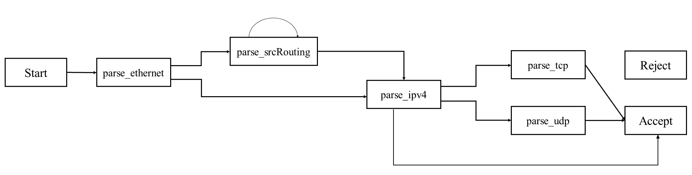
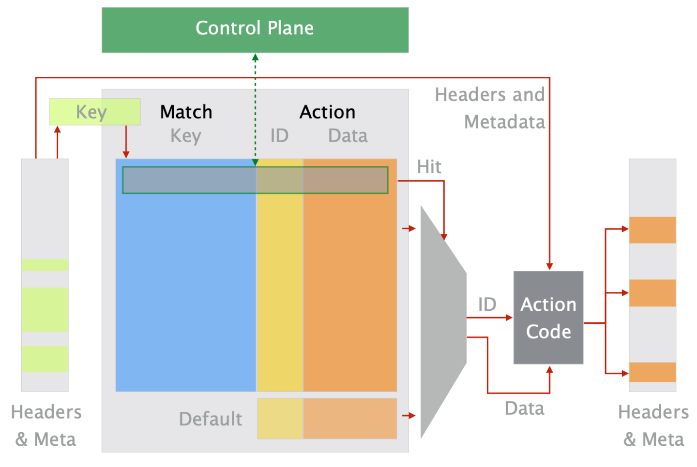

## "Parser"

- 识别接收数据包的包头序列
- 提取数据包中的序列和字段并进行数据包解析



## "Match-action Pipeline"



### "Table"

- 在数据包 Header （数据包包头格式）或 Intrinsic Metadata （数据包关联架构提供的元数据）提取 key （关键值）在当前表中查询，查询到则完成对应 Action （动作）。
- 表中定义 key 值以及键值匹配规则（lpm:最长前缀匹配；exact：完全一致；ternary：指定 bit 匹配）

```p4
table ipv4_fib {
    key = {
        hdr.ipv4.dst_addr: lpm;
    }
    actions = {
        forward;
        drop;
    }
    default_action = drop();
}
```

### "Action"

- 类比C语言里的函数
- 对数据包进行更改的代码
- 函数参数的类别
  1. 无向参数（传入值是通过 table 表项查询到的）
  2. 有向参数（传入值是在 header 中或者 Metadata 中提取到的）
     - in：只读；输入
     - out：可写；输出
     - inout：输入和输出
```p4
action forward(bit<9> egress_port,bit<48> dstAddr) {  //无向参数
    standard_metadata.egress_spec = egress_port;
    hdr.ethernet.src_addr = hdr.ethernet.dst_addr;
    hdr.ethernet.dst_addr = dstAddr;
}
```
```p4
action cs_hash(in bit<32> ipv4_addr, out bit<32> h1) { //有向参数
    hash(h1, HashAlgorithm.crc32, 32w0x00000000, {ipv4_addr}, 32w0x00000f00);
}
```
### 如何插入表项

#### "lpm"

通过 simple switch cli 插入

```p4
table_add 表名 控制流程名.动作名 key值/位数 => 动作的无向参数
```

```p4
table_add ingress.src_entropy_term ingress.get_entropy_term 0/31 => 0
```
通过 json 插入

```
{
      "table": "ingress.ipv4_fib",  
      "match": {
        "hdr.ipv4.dst_addr": ["10.0.1.1", 32]
      },
      "action_name": "ingress.forward",
      "action_params": {
	    "dstAddr": "08:00:00:00:01:01",
        "egress_port": 2
      }
    }
```

table 表名；match 中的第一个参数代表 key 值以及最长前缀匹配位数；action 表示匹配到的动作；action_params 表示对应的参数（无向参数）

#### "ternary"

通过 const_entries 插入

对于每一个ternary字段，表项的值由两部分组成：value &&& mask，mask表示在这个字段上希望匹配哪些bits，1表示匹配，0表示忽略。若 `匹配字段 & mask == value` 则匹配成功。例如：

```p4
const entries = {
    // 该表项表示匹配那些ip src address前24位为10.0.1的数据包，而忽略了ip src 
    // address的最后8位以及ip dst address
    (0x0a000100 &&& 0xffffff00, 0x00000000 &&& 0x00000000): your_action(0x66, 0x8888);

    // 该表项表示匹配ip src address为10.0.2.x，且ip dst address为10.0.1.1的数据包
    // 如果mask全为1，则可以省略mask而只写value
    (0x0a000200 &&& 0xffffff00, 0x0a000101): your_action(0x11, 0x2222);

    // 最后，由于是ternary匹配，一个数据包可能匹配多条表项，因而表项之间需要有优先级
    // 以上述方式书写表项时，越早出现的表项优先级越高。
    // 当使用控制器动态的加入表项时，应该显式指定插入表项的优先级以确保正确性。
}
```
通过 p4 controller 插入（LPM 也同样可使用此方法）

```python
table_entry = p4info_helper.buildTableEntry(
            table_name="MyIngress.ipv4_ternary",
            match_fields={
				"hdr.ipv4.srcAddr": (0x0a000200, 0xffffff00), # (value, mask)
				"hdr.ipv4.dstAddr": (0x0b000100, 0xffffff00)
			},
            action_name="MyIngress.your_action",
            action_params={
				"param1": 0x66,
				"param2": 0x1234
			},
            priority=1
)
```

### "Control"

- 使用定义好的表

  ```
  ipv4_fib.apply()
  ```

- 不能有循环

- 查看 table 是否被 hit （即当前 key 值能否匹配）

  ```
  if(ipv4_fib.apply().hit)
  ```

- 连续匹配操作（使用 if-else）

  ```
  if (hdr.ipv4.isValid()) {         // 判断一个 header 格式是否正确
        if (ipv4_fib.apply().hit) {     // 应用 ipv4_fib 并检查有没有 hit
          forward.apply();              // 应用 forward 这个表
        }
  ```


```p4
control MyIngress(...) {
  /* 函数部分 */
  action drop() {...}               // 定义一下丢掉 packet 的动作
  action set_nhop_index(...) {...}  // 定义一下设置下一跳对应 ID 的动作
  action _forward(...) {...}        // 定义一下转发的动作

  /* 表 */
  table ipv4_lpm {
    key = {                       
      hdr.ipv4.dstAddr: lpm;        // 要求 longest prefix match
    }
    actions = {
      set_nhop_index;
      drop;
      NoAction;
    }
    size = 1024;
    default_action = NoAction();     // 定义默认的动作，就是无动作
  } 

  table forward {
    key = {
      meta.nhop_index: exact;
    }
    actions = {
      _forward;
      NoAction;
    }
    size = 64;
    default_action = NoAction();
  }

  /* 开始控制逻辑 */
  apply {
    if (hdr.ipv4.isValid()) {        
      if (ipv4_lpm.apply().hit) {     
        forward.apply();             
      }
    }
  }
}
```

## "Deparser"

- paser 的逆过程

```p4
control MyDeparser(...) {
  apply {
    packet.emit(hdr.ethernet);
    packet.emit(hdr.ipv4);
    packet.emit(hdr.tcp);
  }
}
```

## 一些更高阶的操作

- recirculating
把 packet 重新送回 Match-Action Pipeline，再过一次流水线

## 参考

[P4 学习笔记（二）- 基础语法和 Parser - 知乎 (zhihu.com)](https://zhuanlan.zhihu.com/p/346936899)

[P4 学习笔记（三）- 控制逻辑与完整的工作流 - 知乎 (zhihu.com)](https://zhuanlan.zhihu.com/p/347282455)

[1小时学会P4-16编程基础-云社区-华为云 (huaweicloud.com)](https://bbs.huaweicloud.com/blogs/detail/288890)

[P4~16~ Language Specification](https://p4.org/p4-spec/docs/P4-16-v1.0.0-spec.html)
