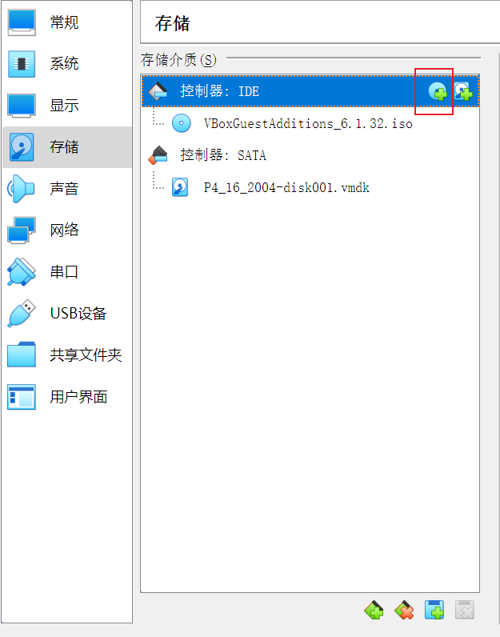

## 未能加载虚拟光盘 \VBoxGuestAddtions.iso 到虚拟电脑 Ubuntu 20.04 LTS

- 打开 virtualbox 选中虚拟机 点击设置-存储-选择虚拟光驱-注册

  

- 选中 VBoxGuestAddtions_6.1.32.iso 并添加 之后重启

## 不能为虚拟电脑 Ubuntu 打开一个新任务 （几种方案都尝试一下）

1. 检查 virtualbox 的安装路径或 Ubuntu 镜像的添加路径是否有中文，如果有的话，请重新安装或重新选择

2. 检查电脑是否开启虚拟化

   

   如果未启用 需要开启虚拟化 不同电脑型号方式可能不同 建议 google 解决方案 此处以联想小新为例

   - 先进入“设置”页面，点击“更新和安全” —> “恢复”—> “高级启动”—> “立即重新启动”
   - 在出现的蓝色界面中选择“疑难解答”→“高级选项”→“UEFI固件设置”
   - 进入了UEFI固件设置界面后，方向键(→)选择configuration，方向键(↓)选择Intel virtualization technology。然后回车，选择enabled，回车。
   - 最后定向到页面下方的 ‘save and exit’, 回车确定。 然后电脑重启即可。
   - 检查此时是否启用

3. 重启 VirtualBox 右键选择管理员运行

4. 找到 virtualbox 安装路径 选择 VBoxSup.inf 右键安装后再次重启 virtualbox

   

5. 打开设置-系统 取消勾选软驱

   

6. 通过禁用 USB 控制器解决问题

   - 在VirtualBox中依次打开“设置->USB设备”，将启用“USB控制器”前面的勾打掉。点击“确定”。
   - 之后，选中刚才报错的虚拟机，点击“启动”，此时已经可以正常启动。

## 启动后显示 “No bootable medium found！System halted”

- 设置-存储 打开看一下是否显示没有盘片 
- 选择添加虚拟光驱-注册-选择 Ubuntu 镜像添加 再次重新启动

## 安装过程中无法移动屏幕 看不到按键

win+鼠标左键 解决

## Installation failed！Error：安装时发生严重错误

参考解决方案：https://b0rgch3n.github.io/post/114567d1d1994d11b3df44396c184632/

## Error relauching VirtualBox VM process：5 Command line：

这个问题比较棘手 试了很多种都没有能一次性解决的 建议大家每一种都试一下

1. 参考解决方案：https://b0rgch3n.github.io/post/114567d1d1994d11b3df44396c184632/

2. 打开注册表编辑器

   - 开始 > 运行 > 注册表编辑器
   - 转到：HKEY_LOCAL_MACHINE\SYSTEM\CurrentControlSet\services\VBoxDrv
     编辑名为 Start 的键。将其值从 1 更改为 3
   - 关闭注册表编辑器并重新启动计算机。计算机重新启动后，您应该可以毫无问题地使用 VirtualBox。

3. 找到 virtualbox 安装路径 选择 VBoxSup.inf 右键安装后再次重启 virtualbox

   

4. 重启 virtualbox 右键管理员运行

## 因为强制结束进程导致的虚拟机异常关机 提示报错“不能为虚拟机打开一个新任务”

1. 右键选中虚拟电脑-选择从资源管理器中打开-检查 vbox后缀的文件是否后缀变成了 vbox-prev ，如果有，删掉 -prev ，直接保存，再次重启虚拟电脑
2. 如果 1 不行的话，说明虚拟电脑文件已经被损坏，需要重新新建

## 新建虚拟电脑时没有 ubuntu64 位选项

是因为电脑没有开启虚拟化，参考本文第二个问题中没有开启虚拟化的解决方案即可解决

## 无法在父文件夹中创建虚拟机文件夹

权限不够，关掉 virtualbox ，右键管理员身份运行即可